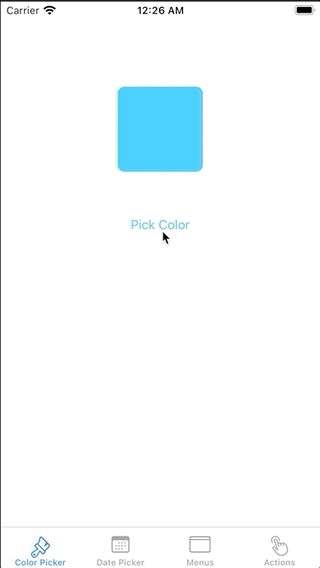
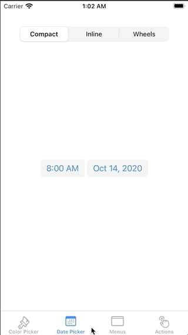
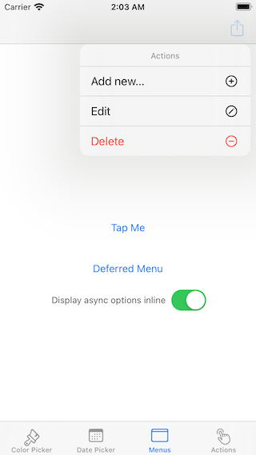
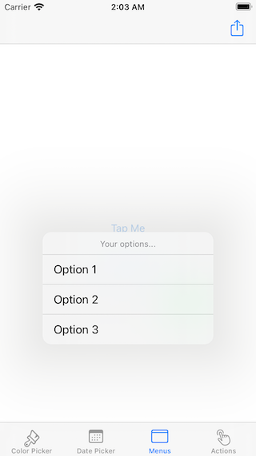
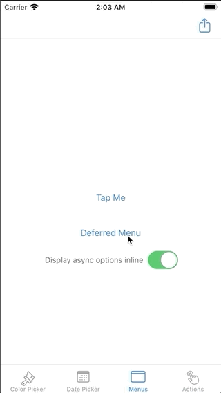
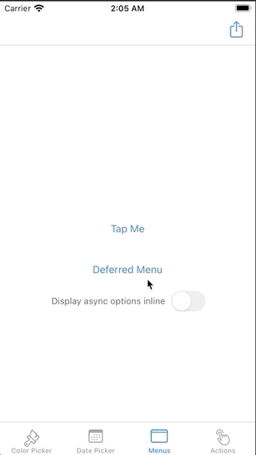

# UIKit updates in iOS 14

Demo app to show new stuff from UIKit in iOS 14 SDK.

Created based on this article: <https://www.appcoda.com/colorpicker-datepicker/>

## ❶ Color picker

## ❷ Date picker

## ❸ Displaying menus

### Static menus

 

### Async menus

 

## ❹ Using UIActions

